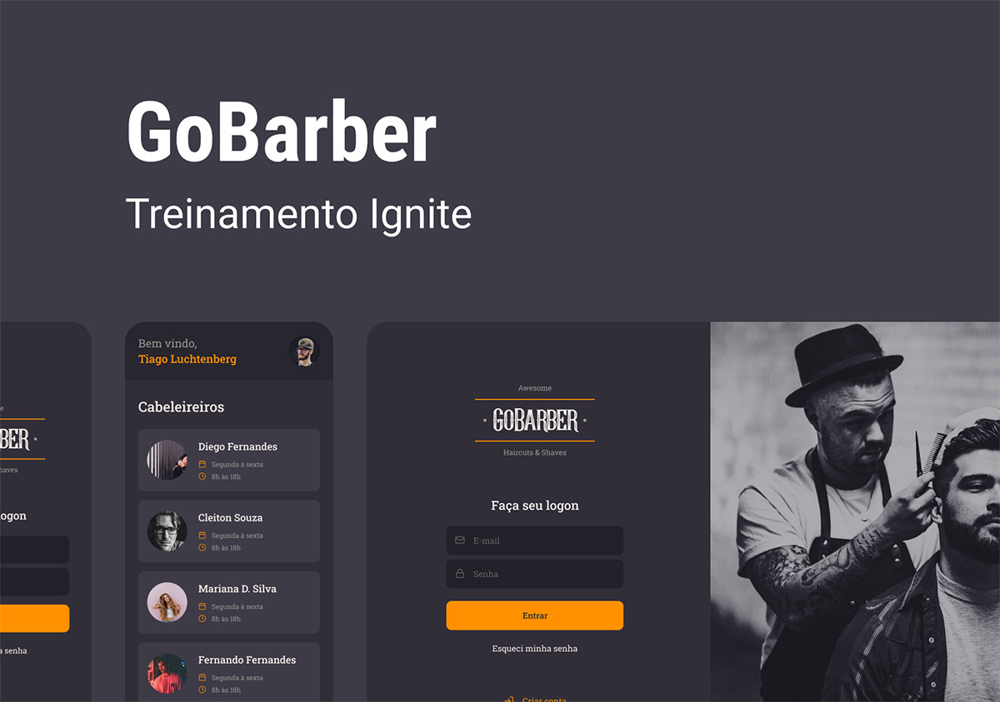

# GoBaber: Plataforma de Agendamento de Serviços de Beleza

    

O GoBaber é uma solução completa para o agendamento de serviços em estabelecimentos como barbearias e salões de beleza. Desenvolvido como parte do GoStack 2020 da Rocketseat, este projeto abrange um ecossistema de aplicações interconectadas, construídas com foco em uma experiência de usuário fluida e eficiente.

A arquitetura do GoBaber é composta por três pilares principais, todos desenvolvidos utilizando TypeScript para garantir maior segurança e manutenibilidade do código:

-   **Back-end (API REST em Node.js):** Responsável pela lógica de negócio da aplicação, esta API RESTful construída com Node.js oferece todas as funcionalidades de CRUD (Criar, Ler, Atualizar e Deletar) necessárias para gerenciar os dados da plataforma. Inclui mecanismos de persistência de dados (utilizando PostgreSQL, conforme mencionado nos requisitos), tratamento robusto de exceções e a exposição de endpoints para comunicação tanto com o front-end web quanto com o aplicativo mobile. Tecnologias chave incluem Express para o servidor, TypeORM para interação com o banco de dados, e ferramentas como Bcryptjs para segurança de senhas e Jsonwebtoken para autenticação.

-   **Front-end Web (Aplicação em ReactJS):** Uma interface web dedicada aos prestadores de serviço. Através desta plataforma, os profissionais podem visualizar de forma clara e intuitiva sua agenda de compromissos, identificando horários ocupados e disponíveis. Construída com ReactJS, a aplicação utiliza bibliotecas como Styled Components para estilização, Axios para comunicação com o back-end e React Router DOM para navegação entre as páginas. O uso de bibliotecas como `date-fns` e `react-day-picker` sugere um foco na manipulação e exibição de datas e calendários.

-   **Front-end Mobile (Aplicativo em React Native):** Um aplicativo móvel desenvolvido para os usuários finais. Este app permite que os clientes naveguem pela lista de prestadores de serviço cadastrados e realizem agendamentos de forma prática e rápida com o profissional de sua preferência. Construído com React Native, o aplicativo utiliza bibliotecas como `@react-navigation` para navegação, `@unform/mobile` para gerenciamento de formulários e `react-native-vector-icons` para aprimorar a interface visual. A presença de `react-native-community/async-storage` indica o uso de armazenamento local de dados.

## Requisitos para Execução

Para executar o projeto GoBaber em sua totalidade, você precisará ter as seguintes ferramentas e configurações em seu ambiente de desenvolvimento:

-   **Git:** Necessário para clonar o repositório do projeto.
-   **Node.js:** O ambiente de execução JavaScript para o back-end e para executar scripts no front-end.
-   **Docker:** Utilizado para rodar um container PostgreSQL, que é o banco de dados utilizado pelo back-end para persistência de dados.
-   **Dispositivo ou Emulador iOS ou Android:** Essencial para testar e interagir com o aplicativo mobile desenvolvido em React Native.

Este projeto demonstra uma arquitetura bem definida e a aplicação de tecnologias modernas para criar uma solução completa e integrada para o gerenciamento de agendamentos em serviços de beleza. 

## Layout

Visualize o design da aplicação e a estrutura das telas no Figma:

[Link para o Layout](https://www.figma.com/design/BXCihtXXh9p37lGsENV614/GoBarber)

## Licença

Este projeto está licenciado sob a Licença MIT.

### ☕❤

[Robson H. Rodrigues](https://www.linkedin.com/in/robson-h-rodrigues-93341746/)